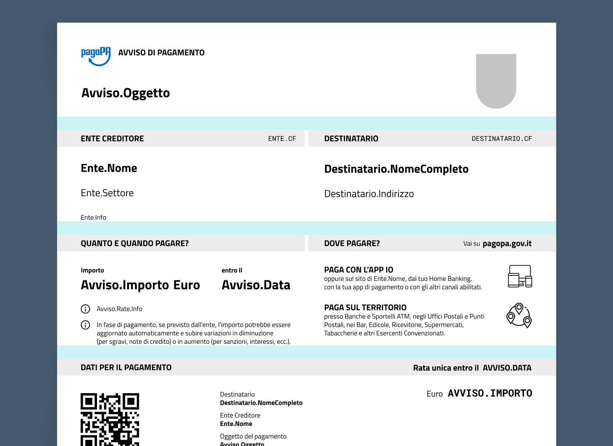

# Margini e spazi


I [**modelli forniti**](../../allegato-1/modelli-base.md) **** tengono già conto di margini e spaziature ottimali.


## Margini di stampa

I modelli forniti prevedono dei **margini esterni di 10mm**, così da garantire la stampa di tutti i dati necessari anche in caso di stampa da parte dei cittadini.

## Spaziature

Nei modelli forniti, le spaziature tra i diversi moduli sono pensate per distribuire al meglio il contenuto rispetto alla pagina, sempre espresse in multipli di 8px.

In presenza di tanto testo, lo spazio minimo da rispettare tra un modulo e l'altro è di **almeno 6mm**.
