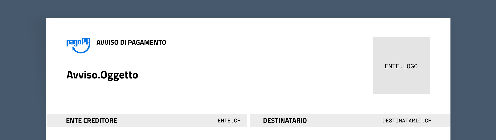

# Intestazione


Se l'avviso è composto da più pagine, mostra sempre l'intestazione per ciascuna pagina.


### `AVVISO.OGGETTO` 



Definisce cosa bisogna pagare, con un testo chiaro e significativo per chi riceve l'avviso.



Stringa



Massimo 90 caratteri, spazi compresi.


Puoi contare i caratteri con un [qualsiasi strumento online](https://www.charactercountonline.com).




Iniziale maiuscola


**Pagamento retta scolastica**



~~**PAGAMENTO RETTA SCOLASTICA**~~

(L'uso delle maiuscole compromette la leggibilità non solo sull'avviso di pagamento, ma anche nelle interfacce digitali (es.: app IO, ricevuta via email).




### `ENTE.LOGO` 



Logo dell'Ente Creditore che incasserà il tributo.



Immagine



30×30mm



Il logo deve essere vettoriale e su fondo trasparente o bianco.


Un logo vettoriale risulta leggibile a qualsiasi dimensione. I formati di un file vettoriale sono ad esempio SVG o EPS. In alternativa, prevedi un file PNG trasparente (o JPG con sfondo bianco) con una risoluzione di 300dpi adatta alle dimensioni richieste.





Il logo, se sviluppato in orizzontale, deve essere appoggiato all’angolo superiore destro dell’area prevista.


